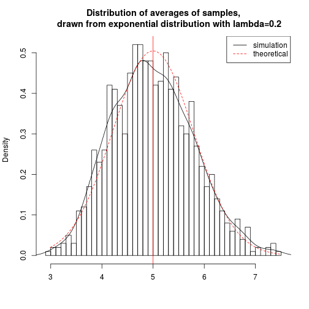
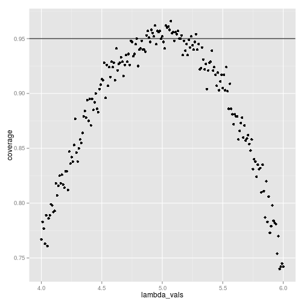

The exponential distribution can be simulated in R with `rexp(n, lambda)` where
`lambda` $\lambda$ is the rate parameter. The mean of exponential distribution is 
$1/\lambda$ and the standard deviation is also $1/\lambda$. For this simulation,
we set $\lambda=0.2$. In this simulation, we investigate the distribution of
averages of 40 numbers sampled from exponential distribution with $\lambda=0.2$.

Let's do a thousand simulated averages of 40 exponentials.


```r
set.seed(3)
lambda <- 0.2
num_sim <- 1000
sample_size <- 40
sim <- matrix(rexp(num_sim*sample_size, rate=lambda), num_sim, sample_size)
row_means <- rowMeans(sim)
```

The distribution of sample means is as follows.

 

The distribution of sample means is centered at 4.9866
and the theoretical center of the distribution is $\lambda^{-1}$ = 5.
The variance of sample means is 0.6258 where the theoretical variance
of the distribution is $\sigma^2 / n = 1/(\lambda^2 n) = 1/(0.04 \times 40)$ =
0.625.

Due to the central limit theorem, the averages of samples follow normal
distribution. The figure above also shows the density computed using the histogram and the
normal density plotted with theoretical mean and variance values. Also, the
q-q plot below suggests the normality.

 

Finally, let's evaluate the coverage of the confidence interval for
$1/\lambda = \bar{X} \pm 1.96 \frac{S}{\sqrt{n}}$

 

The 95% confidence intervals for the rate parameter ($\lambda$) to be estimated
($\hat{\lambda}$) are
$\hat{\lambda}_{low} = \hat{\lambda}(1 - \frac{1.96}{\sqrt{n}})$ and
$\hat{\lambda}_{upp} = \hat{\lambda}(1 + \frac{1.96}{\sqrt{n}})$.
As can be seen from the plot above, for selection of $\hat{\lambda}$ around 5,
the average of the sample mean falls within the confidence interval at least 95% of the time.
Note that the true rate, $\lambda$ is 5.

<!--
---
The report including the code for plots is available at
http://github.com/sefakilic/coursera-statinference/statinference_project_part1.md
-->
